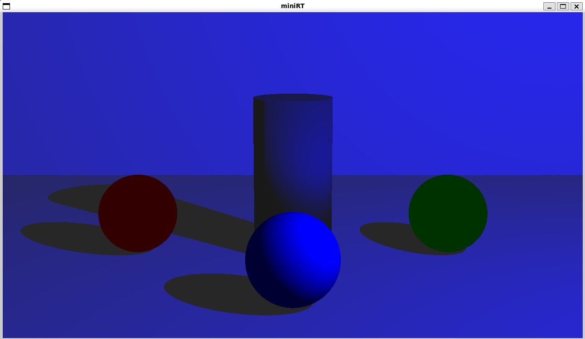
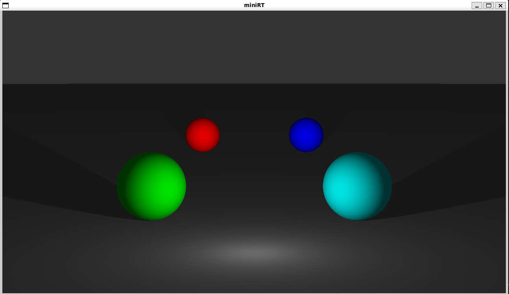
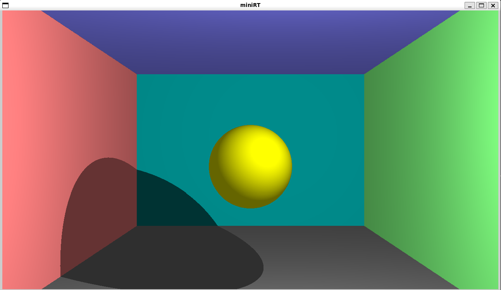
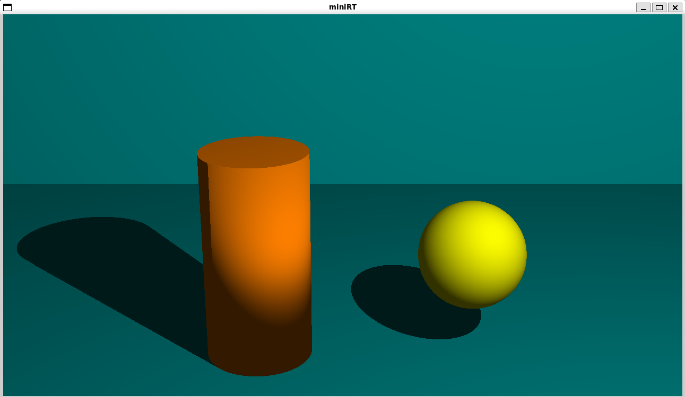

# miniRT
> This project is an introduction to the beautiful world of Raytracing. Once completed you will be able to render simple Computer-Generated-Images and you will never be afraid of implementing mathematical formulas again.
### Ambient Light

### Point Light

### Plane

### Multiple Object


---
## 📝Usage
### 1. Requirement
if you run on Linux. Install `x11` by following command.

```bash
sudo apt-get update && sudo apt-get install xorg libxext-dev zlib1g-dev libbsd-dev
```
### 2. Compilation
To compile the program, run `make` on **miniRT** directory.

```bash
$ make
```
### 3. Execution
The program takes 1 argument (scene) to execute. run:

```bash
$ ./miniRT scenes/sphere_pos.rt
```

## 🗺️Scenes
Here is a simple valid scene:


**Ambient lightning**
|ID|Lighting ratio [0.0 - 1.0]|Colors (R,G,B)[0-255]|
|---|---|---|
|`A`|0.2|255, 255, 255|

**Camera**
|ID|Position (x,y,z)|Direction (x,y,z)[-1 - 1]|FOV [0 - 180]|
|---|---|---|---|
|`C`|-50.0, 0, 20|0.0, 0.0, 1.0|70|

**Light**
|ID|Position [x,y,z]|Brightness ratio [0.0 - 1.0]|Colors (R,G,B)[0-255]|
|---|---|---|---|
|`L`|-40.0, 50.0, 0.0|0.6|10, 0, 255|

**Sphere**
|ID|Position [x,y,z]|Diameter|Colors (R,G,B)[0-255]|
|---|---|---|---|
|`sp`|0.0, 0.0, 20.6|12.6|10, 0, 255|

**Plane**
|ID|Position [x,y,z]|Direction (x,y,z)[-1 - 1]|Colors (R,G,B)[0-255]|
|---|---|---|---|
|`pl`|0.0, 0.0, -10.0|0.0, 1.0, 0.0|0, 0, 225|

**Cylinder**
|ID|Position [x,y,z]|Direction (x,y,z)[-1 - 1]|Diameter|height|Colors (R,G,B)[0-255]|
|---|---|---|---|---|---|
|`cy`|50.0, 0.0, 20.6|0.0, 0.0, 1.0|14.2|21.42|10, 0, 255|

## 🎮Key Controls
In the program, You can only control one thing at a time. Camera, Light, or any Object. and only the first object will be controlled.
|Key|Action|
|---|---|
|`ESC`|Close the program|
|`0`|Select Camera|
|`1`|Select Light|
|`2`|Select Sphere|
|`3`|Select Plane|
|`4`|Select Cylinder|
|`W`|Move forward|
|`A`|Move left|
|`S`|Move backward|
|`D`|Move  Right|
|`Q`|Move Up|
|`E`|Move Down|
|`🡡`|Rotate Up|
|`🡣`|Rotate Down|
|`🡠`|Rotate Left|
|`🡢`|Rotate Right|

## 📑 Documentation 
* [miniLibx Doc](https://harm-smits.github.io/42docs/libs/minilibx)
* [vector](https://www.youtube.com/watch?v=Ej3ZVxljJfo)
* [raytracing](https://raytracing.github.io/)
